Aug 13th, 2020 by: Etienne Deneault

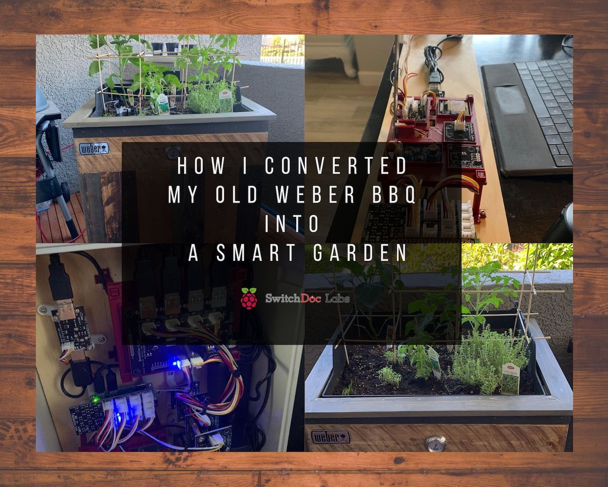

#### How does it work?

My BBQ conversion into a Smart Garden is essentially two major components:

"*A BBQ transformation into a planter Box, remixed with a Raspberry Pi based environmental monitoring and plant watering system.*"

The environmental monitoring uses advanced sensors to monitor the soil moisture, monitor the sunlight, watch the air quality and monitor temperature and humidity. The watering system uses USB 5v submersible pumps with USB Solid State Relays to water the plants when the monitoring system determines it needed.

#### Why would I go through the trouble? Let me explain.

First off, I started this project about a month after the pandemic hit us with the "*shelter in place*" order last March. After completing a few memorable projects with my son Leo, his favorite being the spaceship box-fort in our living room, I realized that I had been spending significant amounts of time on our balcony.  After putting down a floating deck and an LED strip for atmosphere lighting, my attention turned to my old Weber BBQ that was sadly sitting there serving no useful purpose. It was damaged during our recent move from Orlando to Las Vegas. bummer...

I thought I would repair it and maybe... sell it in the future.

Somewhat randomly browsing the internet with coffee that morning there came a moment where I encountered two "*things*" that peaked my curiosity. The first was a few images of BBQ conversions into planter boxes.  The second was a *Raspberry Pi* project kit from a company called [SwitchDoc Labs](https://www.switchdoc.com/) that provides "Smart Garden" functionality wrapped up in a nice package.  Instantly, it was clear to me that a combination of the two was inevitable.  The circumstances made this a project worthy to pursue!

I decided to write this article because I wanted to share the experience with other curious individuals.

#### How did I go about getting it done.
# Please note that this article is not a tutorial… it is a detailed overview.

I started by taking out my little engineering notebook and sketching out a "*general*" design based on what would be needed. There would be a few components to this project: the planter box and cookbox (Carpentry), the plumbing components (Drainage Pipe and Water Supply) and the control enclosures (hardware and software).
 
 

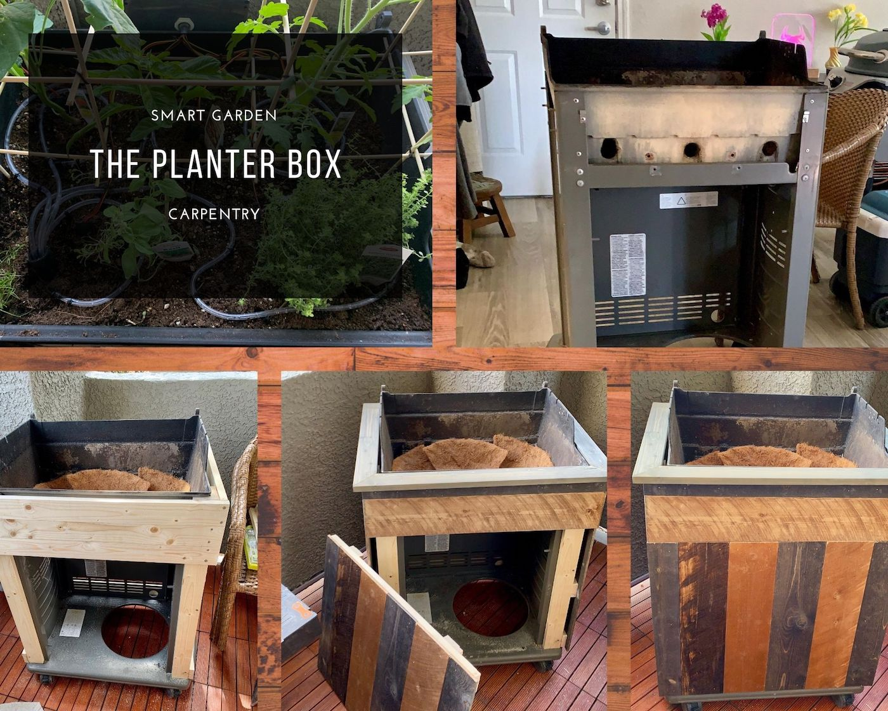

#### The Planter Box

Luckily, a BBQ already provides a metal frame on a wheeled dolly. I proceeded to disassemble the BBQ until all that is left is the frame, the lid assembly and the cookbox. The planter box conversion needs wooden corner pillars connected to the metal frame to be successful.  These pillars will provide the surface needed to nail the paneling. I used metal sheet screws for the corner pillars, it worked quite well with a pre-drilled hole.  

The Weber BBQ that I used did not have typical doors in the front, it has a single front panel (which was flimsy).  I pondered with the idea of building some doors but, in my mind, it seemed like a lot of work.  My carpentry skills are intermediate at best and... I don't have a *Miter Saw* and use a *Circular Saw* for all the cuts which adds to the challenge of cutting accurately (the Miter Saw is on my birthday gift list).

Eventually, and by this I mean after a few days of mulling it over, I realized that a front panel is the best solution. I noticed that the metal frame of the BBQ lends itself well to use magnets to secure the panel when closed.  For this purpose I used cabinet door magnets, *Voilà!*, it works great.

I had a brief moment where I thought that I was clever, but quickly I realized that it was a panel there in the first place and that I spent two days thinking about the doors when it was right in front of my eyes.  So... not that clever after all.

The next step was to build the cap railing around the top of the newly added wooden frame. This sounds trivial but if the corner pieces installed onto the frame were not perfectly cut, they will not be level. I say that because mine were a bit off… I will blame it on the circular saw… nothing too outrageous, I solved the issue with a small sander quickly.

If you look at the pictures above, you will see a big hole in the BBQ floor, this is where the propane tank used to sit.  Quickly, I took a few measurements and cut out a square insert out of plywood.  I secured it using the same metal sheet screws as I had used earlier.

The final rewarding step of the carpentry section was to install the wood paneling.  For this, I was a bit lazy and bought a few sets of reclaimed [wood planks](https://www.homedepot.com/p/Weaber-Weaber-1-2-in-x-4-in-x-4-ft-Weathered-Hardwood-Board-8-Piece-27862/207078140), not the real deal but a half decent imitation. Looking at the BBQ, I mean... planter box, the project started to feel real.
 
 

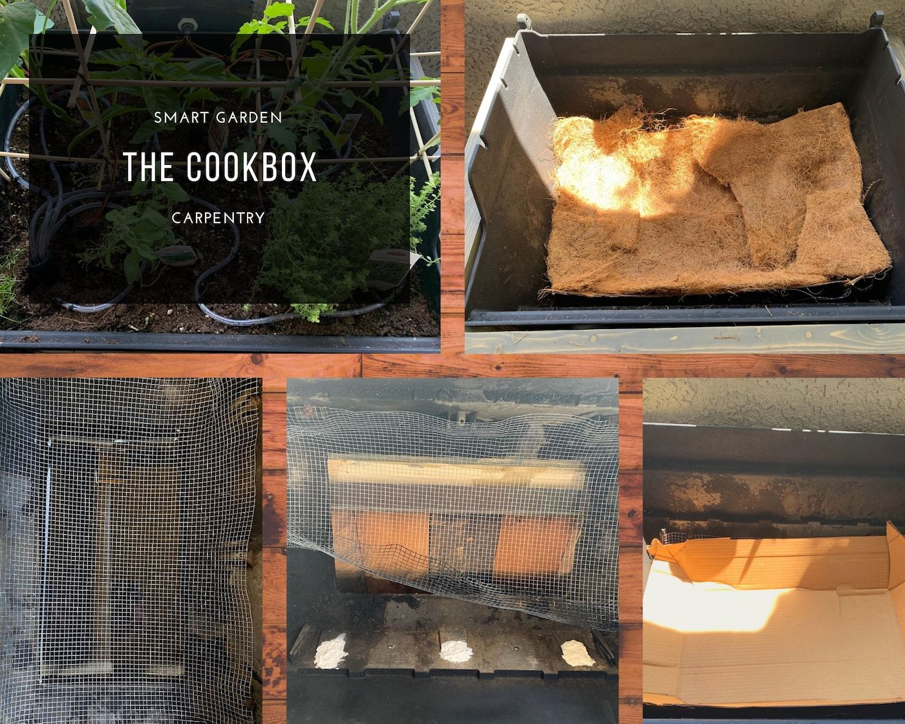

#### The Cookbox

The cookbox conversion turned out to be a fairly straightforward process.  

*The box needs to hold the soil securely and allow for the watering tubes to be routed from the water tank below to the surface of the soil in the cookbox.*  

I proceeded by giving the cookbox a good cleaning to free it from the grease and residue caused by grilling in it's past life.  Soap, water and a good wire brush did the trick here.  Once it was nice and dry, I applied a [Rustoleum Engine Enamel Spray Paint (black)](https://www.homedepot.com/p/Rust-Oleum-Automotive-12-oz-Gloss-Black-Engine-Enamel-Spray-Paint-248932/202097788) to give it a fresh look.  The engine enamel is very tough and will withstand anything that nature could throw at it.  This stuff is nasty, I made sure to be outdoors and wearing a respirator when applying it.

After a few coats and an adequate amount drying time, the next step was to fill in the holes that where previously there to accommodate the bbq knobs and igniter.  

I used [silicone door sealant](https://www.homedepot.com/p/DAP-Silicone-Max-10-1-oz-White-100-Premium-Window-Door-and-Siding-Silicone-Sealant-08790/206046714) and added a "*backing*" to the hole with duct tape to facilitate the application.  Once the cocking was dry, I drilled a large hole through the far left hole. I passed through a piece of hose with a large diameter (as large as I could fit in the hole) to serve as a channel for the smaller watering vinyl tubes to travel through from the water tank below to the soil on top.  

I did this step somewhat in reverse, I should have passed through the hose and then did the cocking... either way, it worked, maybe adding a bit of time to the process.

Next, I installed a piece of chicken wire fencing as a soil retainer, added some cardboard boxing as the next layer and finally, some coconut fiber planter liner (see pictures above).

The cook box sits into the frame and is not connected in any way, it is removable. In its' previous form, the cookbox was connected to the rest of the structure by the knobs and igniter hardware.  I did not feel that connecting the cookbox was necessary due to the weight of the soil and the added benefit of removing it easily if needed.  

This was all that was needed and I called it "*done*".
 
 

#### The Plumbing

##### The Drainage Pipe

To provide adequate drainage to the BBQ planter box, I needed to have some form of plumbing.  It would have been a 'bad thing' if the water from the soil above would leak into the 'insides' and possibly cause some 'havoc'.

Using the BBQ's original design, a liquid catch system is already built into the BBQ, the grease catch pan.

All I had to do... is attach gutter drainage pipe and cut out a rectangular hole in the plywood at the bottom of the planter. Conveniently, where the gas tank hole was that I had covered earlier.

 A bit like the front panel in the planter box, it took me a while of 'pondering' before I realized that using the infrastructure already provided to me by the BBQ was the way to go.

##### The Water Supply

The water tank was challenging in the sense that it is not a very complex component but finding the right tank was difficult.  

The tank could not be too big or to small.

Too big, it would be difficult to move out of the way to open the main enclosure door. While too small would force me to refill the tank too often.

The first tank that I bought was too big, I returned it and purchased the one that you see in the pictures.  This tank fit much better and was easy to work on until I put the pumps in...  I realized that if a pump fails for any reason, it would be very difficult to get it out.

Nonetheless, I moved forward and drilled-in holes to place the ultrasonic sensor that measures the tank level.  

In the long term, I will need to replace this tank with something more functional. It is not a time consuming job, a matter of hours and it could be done.  

I have been procrastinating until a pump fails...
 
 

#### The Control Enclosures

The main enclosure and smaller *satellite* enclosure were for me the most enjoyable part of the project. Over the last year, I built a few enclosures so I had some experience to help me through.

A few words about SwitchDoc Labs and the Smart Garden System kit.  

*SwitchDoc Labs is a software and hardware engineering company producing specialized products and designs for the small computer industry maker movement ([Raspberry Pi](https://www.raspberrypi.org/), Arduinos and others).*

The large majority of the products offered use [Grove](https://wiki.seeedstudio.com/Grove_System/) connectors for wiring thus relieving the builder from more complex wiring and soldering.  

Although, I feel comfortable in those areas, the idea of making it more accessible to a larger audience is for me admirable and a strong strategy to promote learning.  The products are also aimed at the technologies of the future. Super awesome!   

Over the course of the project, I had a few questions which I asked using their messenger chat platform and they answered promptly.  When I had a part break, they replaced it fully honoring the 30 day warranty. I only have good things to say about my interactions with their employees.

The basic [Smart Garden System](https://shop.switchdoc.com/products/smart-garden-system-raspberry-pi-based-smart-gardening-kit-no-soldering) kit from SwitchDoc labs provides a suite of environmental sensors and control components for 1 moisture sensor/ and one submersible pump.

For this *planter-bbq*, I was envisioning up to 5 plants or zones in the planter box.  Fortunately, SwitchDoc Labs offered a [Plant Extender Kit](https://shop.switchdoc.com/products/smart-garden-system-4-plant-extender) that adds 4 pumps and 4 sensors to the Smart Garden System. *All set!*  

I made the orders and the kits arrived within a few days. The kit did not included the Raspberry Pi, I needed to provide my own.  Luckily, I had a [Rasp Pi Zero W with headers](https://www.sparkfun.com/products/15470#:~:text=The%20Pi%20Zero%20W%20has,core%20processor%20with%20512MB%20RAM.) left over from a previous automation project.  The kit will function with pretty much any Raspberry Pi.

This article already in long form,  I will not go into the full details of the Raspberry Pi based control system build. The instruction manuals available online for the Smart Garden System are quite good and this article is meant as an overview and not a tutorial. SwitchDocLabs also has a forum online with solutions to the most encountered issues.  

Instead, I will walkthrough the general steps that I followed.

The first step was to assemble the basic kit and mount it onto a plywood board, download the software and run the code in Python 3. Run the *testAllSensors.py* program to validate they are functioning as intended.

In this kit, the programming is done for you.  Note: Having some experience with Python and Command Line on a Raspberry Pi was useful, but not absolutely necessary.  The instruction manuals provided most of what is needed to get running.

The *sensor* test proved successful. *Yeah win!*  

I proceeded with adding the expansion kit to the plywood board and prepare the water supply.  Before adding water to the system, it is necessary to run a program to calibrate the water level sensor. I did so with no issues. I gathered 5 small plants pots and filled them with soil, inserting a moisture sensor in each one and connected the pumps to the USB relays.  

The moment of truth was here… it was time to execute the main program *SGS.py*. My self dialogue was something like what follows:

"*When I press RETURN, the following should occur:
The program will initialize, test all the sensors, receive an alert that the moisture levels of the plants are low (because the plants have never been watered) and start watering the plants one at a time until the soil reaches an adequate level of moisture.*"

Having done, a few of these types of projects before, my hopes of everything going as anticipated was measured… but the program executed and proceeded to accomplish its purpose, the pumps started watering one at a time.

After a few moments of self-congratulations, whether deserved or not, I proceeded in installing the Blynk App.

The Blynk App is an IoT platform on iOS and Android for businesses and developers that brings control and dashboard capabilities over the internet. SwitchDocLabs has an easy tutorial to follow and a one time payment of $10.00 USD is required to add *Blynk energy*, that is how Blynk measures the cost.  Interesting concept.

Dashboard                                            | Plants Moisture                                       |   Watering Control
:---------------------------------------------------:|:-----------------------------------------------------:|:----------------------------------------------------:
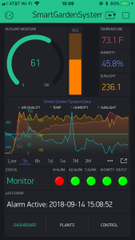 |  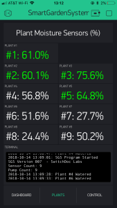 | 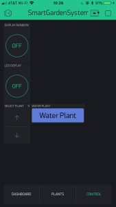

Once the set-up was completed, the App started populating the data from the sensors. The App also provided the ability to "force water" each plant individually, all this of course over the internet. The App is pretty sweet and quickly became my preferred interface to the system.

I then left for a family camping trip and left the system running. The goal was to see the reliability and consistency of access over a few days. It turned out to work flawlessly, when I came back the system was purring along just fine and my water tank had 30% of its water left.

Happy with how the control system was functioning, it was time for me to build the enclosures that would ultimately live in the Smart Garden BBQ.

Main Enclosure                                  |  Close-up View                                         | Exterior
:---------------------------------------------------:|:-----------------------------------------------------:|:---------------------------------------------------:
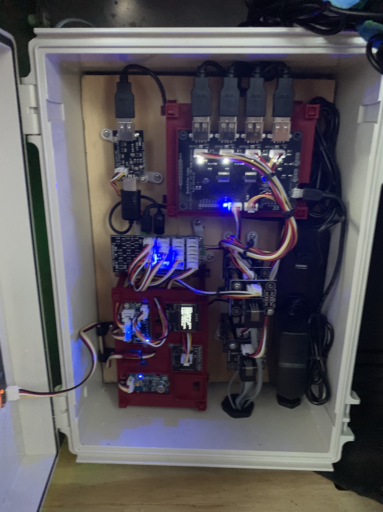 |  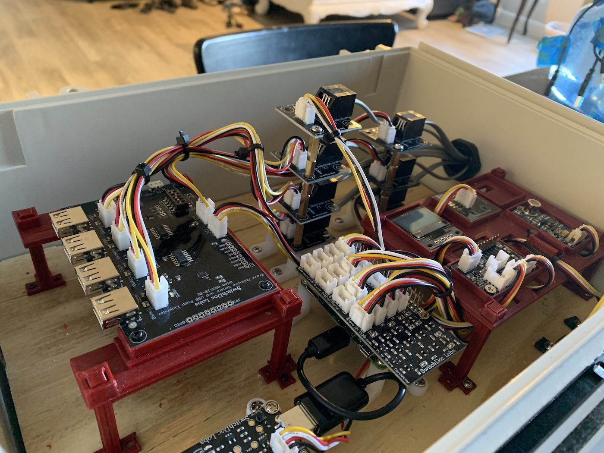 | 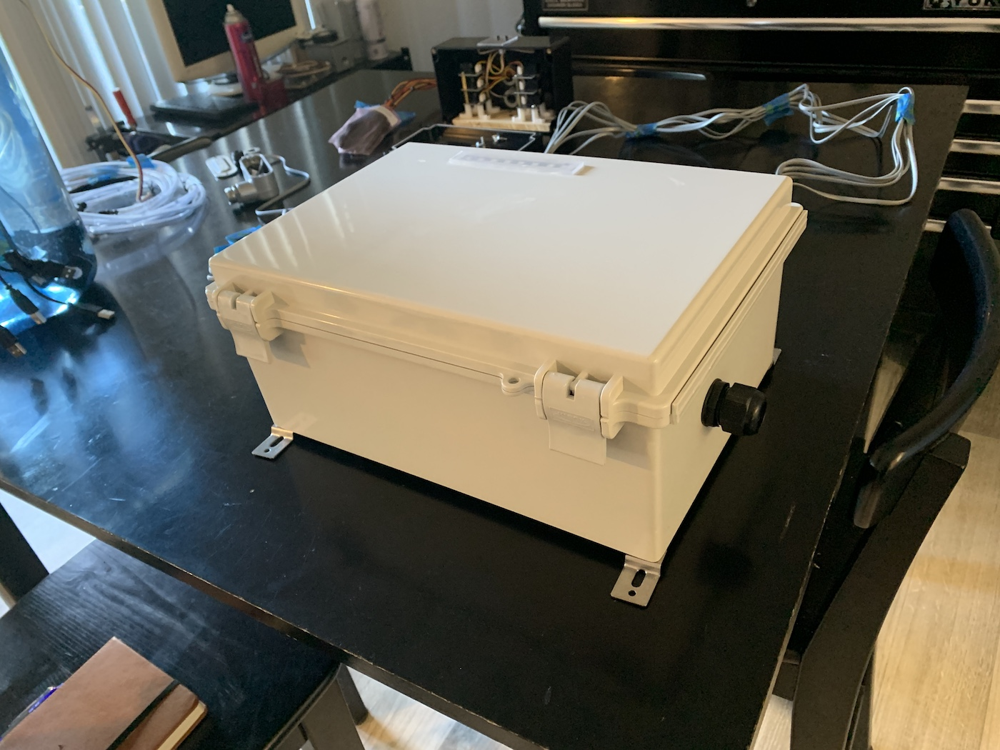
Enclosure while in operation. |  Build picture without USB pumps and power bar. |  LED bar relocated to  the top of the case

Building a control enclosures requires lots of *stuff*. The enclosures, a mounting surface, mounting hardware, cable glands, heat-shrink tubing, power bar, etc... the list goes on.  It can be expensive to get started building these kinds of enclosures.  Fortunately,  I had most of what was needed from previous projects.  All I needed to order was the main enclosure. (insert link) and a few other parts and consumable supplies.  

Sure, it would have been possible to build it much cheaper, by say... using a sterilite container, cheaper hardware, less cable management and less environmental protection... but the goal here was to weatherproof a kit that is meant to *live* outdoors for a long time.  

I made a few compromises along the way, the most significant was the decision to forgo building a cooling fan into the case.  I did not feel it to be needed.  Later on, the decision would prove itself a good one. The Smart Garden System performed just fine in 115ºF Las Vegas summer temperatures.

I encountered one major challenge that I did not expect. It was caused by the length of the grove cables connecting the main enclosure to the moisture sensors up above, in the soil.  I needed a length of approximately 110 cm (≈ 3ft 7). The grove cables that connect to the sensors are rarely longer than 50 cm because they would suffer from voltage drop, capacitance and noise.  Basically, signal degradation.

I should have thought about it because I had some experience with the issue in the past, but I didn't.  After a quick chat with SwitchDoc Labs, I went ahead and purchase 6 pairs of grove cable extenders from them. The extenders facilitate longer distances by using either RJ11 (telephone cable) or RJ45 (ethernet cable) as a bridge or tunnel. This issue forced my hand into building a somewhat larger *satellite* enclosure then I had originally planned.

Let's discuss the *satellite* enclosure. This enclosure sits at the back of the cookbox on the outside of the planter box, it was originally meant to be very small and only house the sunlight sensor. With the need to have extenders, it would now need to house the sunlight sensor and the grove extenders.
 
 

Satellite Enclosure                                  |  Close-up View                                         | Sunlight Sensor
:---------------------------------------------------:|:-----------------------------------------------------:|:---------------------------------------------------:
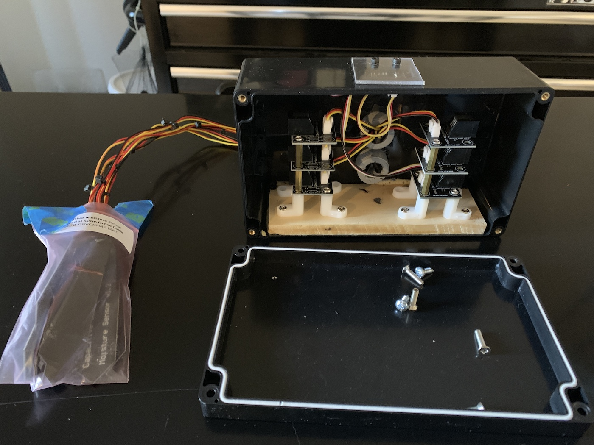 |  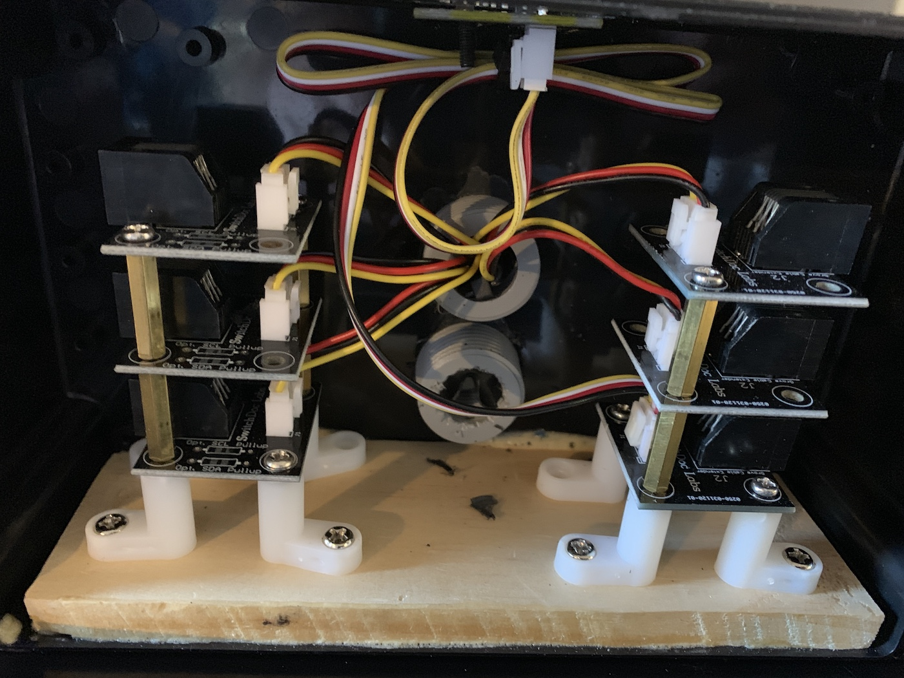 | 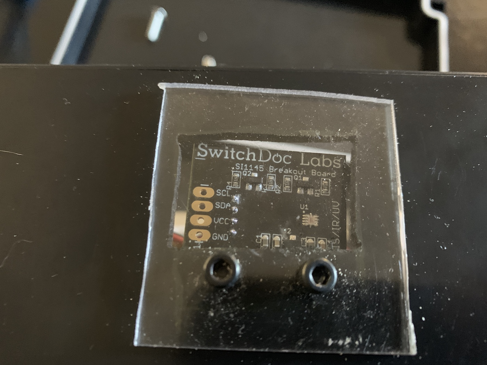
Six (6) grove extenders and one (1) sunlight sensor |  (Two cable glands in the case, one for the RJ11 cable, one for the RJ11 entry and one for the grove cables exit |  Sunlight sensor with acrylic sheet cover.  The acrylic is not cut well, it needs to be replaced.

  The sunlight sensor had to be relocated to outside of the BBQ planter  access direct sunlight. But then...what about the other sensors?

  I left the other sensors inside the enclosure because the temperature/humidity sensor would provide the temperature and humidity inside the enclosure which I was happy to know and the air quality sensor is so sensitive that it works just fine even  from inside.  It will register change when a candle is light nearby.

  Now that I had the enclosures working well it was time to put it all together.

  #### The Final steps

  Once all the components were built, I still had to complete the final assembly.  A few things were left on the knock-list:
  * Install the enclosures, pass the water tubes from inside the case through the tunnel into the cookbox
  * Fill-up the cookbox with soil, soak the soil, plant the veggies and finally arrange the tubing around the plants.  
  * Built supports for the plants out of wooden dowel sticks to help support them as they would grow.  

All these details were not very difficult to do and soon enough the Smart Garden was fully functioning.  

### Last thoughts.

I know that this article has been long but I wanted to fully share my experience doing this project and the gratification that building it brought to me. My goal was to give a complete overview while not going into nitty-gritty details that a tutorial would include.  If you have read until here, thank you for your curiosity. Maybe... this article will inspire someone else to build something amazing.

### Code and Updates
* *Since I converted my BBQ into the Smart Garden, SwithDoc Labs has released a V2 of the Smart Garden System adding wireless control units and many other features.*
[SwitchDoc Labs - Smart Garden System (V2)](https://shop.switchdoc.com/collections/smart-garden-system/products/smart-garden-system-v2-raspberry-pi-based-smart-gardening-kit-no-soldering) (*If I had to build another one, this would definitely be a game changer!*)
